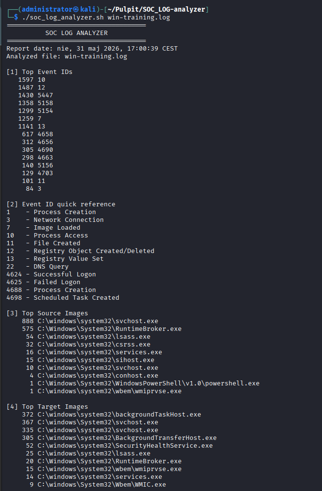
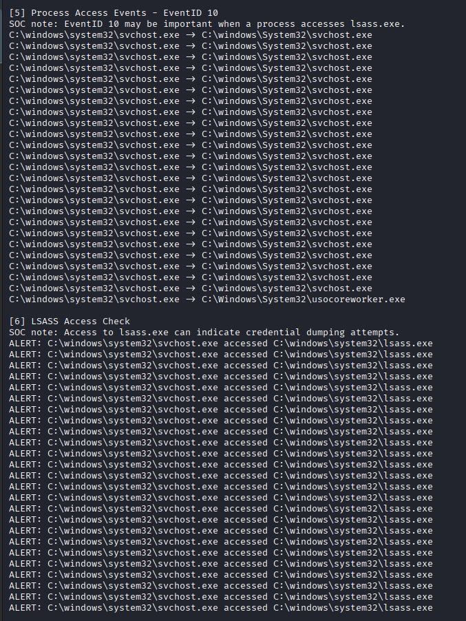
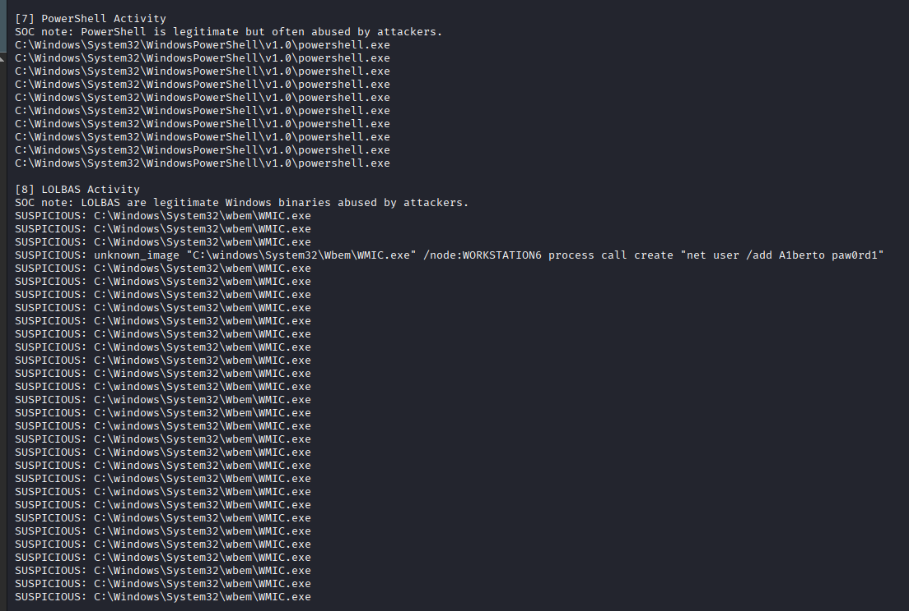
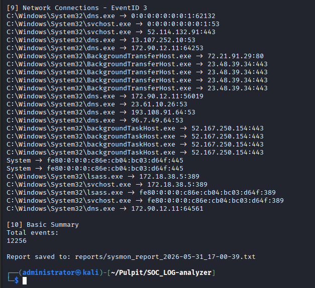

# SOC Log Analyzer

This is a small Bash project I created while learning SOC analysis and Linux command-line workflows.

The idea behind this tool is simple: I wanted to practice working with Windows/Sysmon logs, understand Event IDs better, and learn how basic SOC-style log analysis can be automated with Bash and jq.

The script reads JSON-based Windows logs and creates a basic text report. It can show the most common Event IDs, source and target processes, possible LSASS access, PowerShell activity, LOLBAS usage, and basic network connection events.

This project is mainly educational. It is not meant to replace a real SIEM or professional detection platform. I use it as a practical way to improve my Bash scripting, log analysis, and SOC investigation skills.

## Requirements

The script needs Bash and jq.

On Debian/Kali/Ubuntu, jq can be installed with:

```bash
sudo apt install jq
````

## Usage

First make the script executable:

```bash
chmod +x soc_log_analyzer.sh
```

Then run it against a log file:

```bash
./soc_log_analyzer.sh sample.log
```

You can also display the help menu:

```bash
./soc_log_analyzer.sh --help
```

## Example Output

```text
[6] LSASS Access Check

ALERT: C:\Windows\System32\WindowsPowerShell\v1.0\powershell.exe accessed C:\Windows\System32\lsass.exe
```

## Screenshots









## Project Structure

```text
SOC-Log-Analyzer/
├── soc_log_analyzer.sh
├── README.md
├── .gitignore
├── reports/
└── screenshots/
```

## Future Ideas

In the future, I would like to improve the detection logic, add MITRE ATT&CK mapping, create HTML reports, add IOC extraction, and maybe support Linux auth.log files as well.

## Author

Created by Jakub Zytlinski as part of my SOC analyst learning journey.

